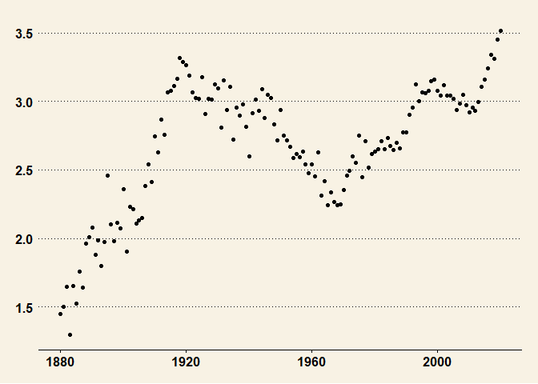
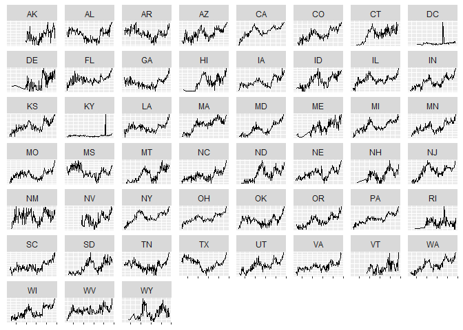

Gender Neutral Names
================
Vishal Lala
1/17/2022

Over the last couple of decades, the line distinguishing gender roles
has blurred. Increasingly, men are taking on tasks and jobs that were
previously linked to women and a growing number of women are happy to
let the husband manage the kids while she becomes the primary
bread-getter for the family. Men are no longer shying from jobs in
nursing and women are taking on manufacturing jobs.

Has the evolution of our thinking of gender stereotypes had an impact on
how parents name their kids? Over the last decade, names such as
Charlie, Sklyer, and Dakota have been given to boys and girls in
approximately equal proportion. The question we examine is whether there
has been an increase in such gender-neutral names over time. We define
gender-neutral as being a name for one gender is also given to at least
25% of the other gender. For instance, a name given to 30% male babies
(and therefore 70% female babies) would qualify as a gender-neutral
name.

The data for this study was obtained from the [Social Security
Administration’s (SSA) website](https://www.ssa.gov/oact/babynames/)
which has shared data on names of babies and their gender going back
more than a 100 years. The yearly data shared by SSA was first combined
into a single file.  
The data was gathered from the SSA on Jan 18, 2022

``` r
data_us = read.csv('https://raw.githubusercontent.com/pseudorational/datasets/main/baby_names.csv')
library(dplyr); library(ggplot2)
dat_us = 
  inner_join(data_us[data_us$gender=='M',],
           data_us[data_us$gender=='F',],
           by=c('name'='name','year'='year'))%>%
  mutate(pct_male = 100*(n.x/(n.x+n.y)))%>%
  filter(pct_male>=25 & pct_male <=75)%>%
  group_by(year)%>%
  count()%>%
  ungroup()%>%
  inner_join(
    data_us %>%group_by(year)%>%summarize(total_n = n())%>%ungroup(), by = c('year'='year'))%>%
  mutate(pct_gender_neutral = (n/total_n)*100)%>%
  select(year, pct_gender_neutral)%>%
  right_join(data.frame(year = 1880:2020,pct_gender_neutral = 0),by = c('year'='year'))%>%
  mutate(pct_gender_neutral = ifelse(is.na(pct_gender_neutral.x), pct_gender_neutral.y, pct_gender_neutral.x))%>%
  arrange(year)%>%
  select(year, pct_gender_neutral)
dat_us
```

    ## # A tibble: 141 x 2
    ##     year pct_gender_neutral
    ##    <int>              <dbl>
    ##  1  1880               1.45
    ##  2  1881               1.50
    ##  3  1882               1.65
    ##  4  1883               1.30
    ##  5  1884               1.65
    ##  6  1885               1.53
    ##  7  1886               1.76
    ##  8  1887               1.64
    ##  9  1888               1.96
    ## 10  1889               2.01
    ## # ... with 131 more rows

``` r
dat_us%>%
  ggplot(aes(x=year, y = pct_gender_neutral))+
  geom_point()+
  ggthemes::theme_wsj()
```

<!-- -->

Here are the Top 5 Gender-Neutral Names by Year. Note, only names that
qualify our definition of gender-neutral are included, so for certain
years, there may be fewer than 5 names.

``` r
inner_join(data_us[data_us$gender=='M',],
           data_us[data_us$gender=='F',],
           by=c('name'='name','year'='year'))%>%
  mutate(pct_male = 100*(n.x/(n.x+n.y)))%>%
  filter(pct_male>=25 & pct_male <=75)%>%
  filter(n.x>1000)%>%
  mutate(gen_neutral = abs(pct_male - 50))%>%
  group_by(year)%>%
  slice_min(gen_neutral,n = 4)%>%
  ungroup()%>%
  arrange(desc(year))%>%
  select(year, name)
```

    ## # A tibble: 428 x 2
    ##     year name   
    ##    <int> <chr>  
    ##  1  2020 Charlie
    ##  2  2020 Finley 
    ##  3  2020 Phoenix
    ##  4  2020 Blake  
    ##  5  2019 Charlie
    ##  6  2019 Finley 
    ##  7  2019 Phoenix
    ##  8  2019 Emerson
    ##  9  2018 Charlie
    ## 10  2018 Finley 
    ## # ... with 418 more rows

Next, we explore the trends in gender-neutral names across different
States.

``` r
library(dplyr); library(ggplot2)
data = read.csv('C:/myFiles/Learning/datasets/baby_names_by_state.csv')

dat = 
  inner_join(data[data$gender=='M',],
           data[data$gender=='F',],
           by=c('name'='name', 'year'='year','state'='state'))%>%
  mutate(pct_male = 100*(n.x/(n.x+n.y)))%>%
  filter(pct_male>=20 & pct_male <=80)%>%
  group_by(state, year)%>%
  count()%>%
  ungroup()%>%
  inner_join(
    data %>%group_by(state, year)%>%summarize(total_n = n())%>%ungroup(), by = c('year'='year', 'state'='state'))%>%
  mutate(pct_gender_neutral = (n/total_n)*100)

library(ggplot2)
library(gridExtra)
dat%>%
#  filter(state %in% c('NJ','CA','AK'))%>%
  ggplot(aes(x=year, y = pct_gender_neutral))+
#  geom_point()+
  geom_line()+
  facet_wrap(~state, scales = 'free_y')+
  ylab(label = '')+
  theme(axis.title.x=element_blank(),
        axis.text.x = element_blank(),
        axis.title.y=element_blank(),
        axis.text.y = element_blank(),
        axis.ticks.y=element_blank())
```

<!-- -->
